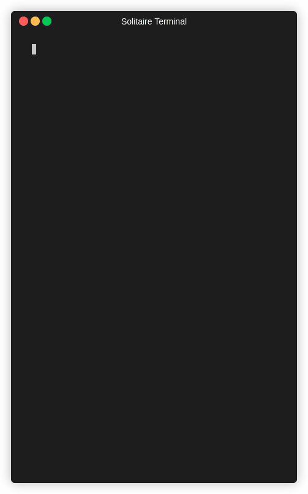

# Solitaire Game for Terminal

Welcome to the Solitaire Game for Terminal! This repository contains two versions of a classic Solitaire game that you can play directly in your terminal. The first version operates via typing commands without any escape sequences, while the second version uses escape sequences for a more interactive experience.



## Getting Started

### Prerequisites

- A C compiler (e.g., GCC)
- A terminal emulator

### Installation

1. Clone the repository:
    ```sh
    git clone https://github.com/spaceymonk/solitaire-terminal.git
    cd solitaire-terminal
    ```

2. Compile the command-based version:
    ```sh
    gcc -o solitaire_noesc solitaire_noesc.c
    ```

3. Compile the interactive version:
    ```sh
    gcc -o solitaire solitaire.c
    ```

### Running the Game

To start the command-based game, run the following command in your terminal:
```sh
./solitaire_noesc
```

To start the interactive game, run the following command in your terminal:
```sh
./solitaire
```

## Game Versions

### Version 1.1: Interactive Solitaire with Escape Sequences (`solitaire.c`)

This version provides a more interactive experience by rendering the game board using escape sequences and capturing key presses via the termios library for Linux and conio library with `stb_keypress.h` file. Here are the controls:

- **`a` and `d` keys**: Move left and right around the piles.
- **`w` and `s` keys**: Move up and down while on column piles to select cards.
- **`e` key**: Collect the selected card.
- **Space bar**: Move cards around.

#### How to Play

- **Starting the Game**: After running the game, you'll see the rendered game board.
- **Moving Around**: Use `a` and `d` keys to move left and right around the piles.
- **Selecting Cards**: Use `w` and `s` keys to move up and down while on column piles to select cards.
- **Collecting Cards**: Press the `e` key to collect the selected card.
- **Moving Cards**: Use the space bar to move cards around.

### Version 1.0: Command-Based Solitaire (`solitaire_noesc.c`)

This version allows you to play the game by typing commands directly into the terminal. Here are the supported commands:

- **quit**: Exit the game.
- **buy**: Draw cards from the deck.
- **move poll to col %d**: Move the top card from the poll to the specified column.
- **collect col %d**: Collect a card from the specified column to the foundation.
- **collect poll**: Collect a card from the poll to the foundation.
- **move fnd %d to col %d**: Move a card from the specified foundation pile to the specified column.
- **move seq %c%c to col %d**: Move a sequence of cards starting with the specified card to the specified column. (e.g., "move seq JD to col 3" to move the sequence starting with Jack of Diamonds to column 3).

#### How to Play

- **Starting the Game**: After running the game, you'll see the initial setup of the cards.
- **Issuing Commands**: Type the commands listed above to interact with the game.
- **Quitting the Game**: Type `quit` to exit the game.

#### Example Commands

- To draw cards from the deck:
  ```sh
  buy
  ```

- To move the top card from the poll to column 3:
  ```sh
  move poll to col 3
  ```

- To collect a card from column 2 to the foundation:
  ```sh
  collect col 2
  ```

- To move the sequence starting with Jack of Diamonds to column 4:
  ```sh
  move seq JD to col 4
  ```

---

Enjoy your game!
